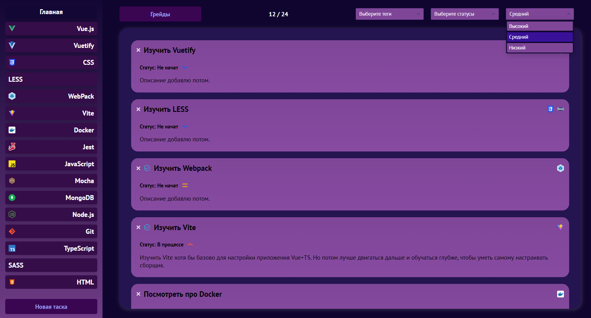

# progressive-tasker
Таскер, в котором можно удобно распределить свои задачи. С фильтрацией, сортировкой, системой грейда (автоматической), с маршрутизацией на Vue Router и хранилищем на Pinia.


## Project setup
```
npm install
```

### Compiles and hot-reloads for development
```
npm run serve
```

### Compiles and minifies for production
```
npm run build
```
